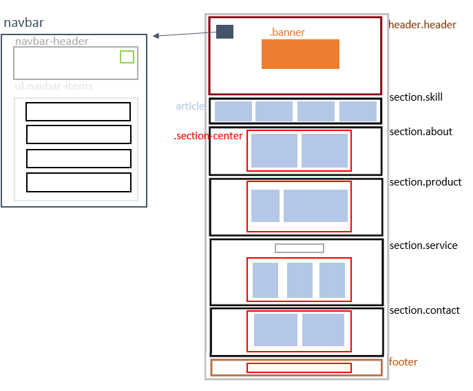

# Crazy Steak Project
## 目的
  * First HTML & CSS project ( 單純畫面呈現，未做畫面跳轉 )
  * [成品]( https://crazy-steak.netlify.app/ )

## 技術細節
  - *postion*
    - fixed 
    - relative
    - absolute
    - z-index
  - *display & float*
    - block
    - inline
    - inline-block
  - *Animation*
    - transition
    - transform
    - w/keyframes
  - *Unit*
    - rem, vh, vw, %, px,
  - *RWD*
    - media query
  - *other*
    - font、color、backgroun、image、 box model ......
    - 一些小圖片來自 [fontawesome]( https://fontawesome.com/ )
## 作法
 ### crazy steak html structure : 
   

## 筆記
  1. 定義出會被重複用到的 property value 到 `:root{}` 裡，以及思考哪些樣式會重複用到( 例如:`body{}`, `p{}`, `.section-title{}`...... )
  2. RWD 方面
     * 通常先從螢幕最小到大來設計( breakpoints : 576px, 768px, 992px, 1200px )
     * `.section-center` 目的就是為了避免超過 1200px 的超大螢幕，導致畫面分散
